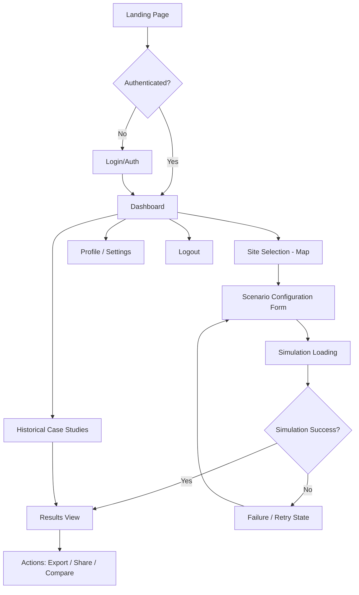
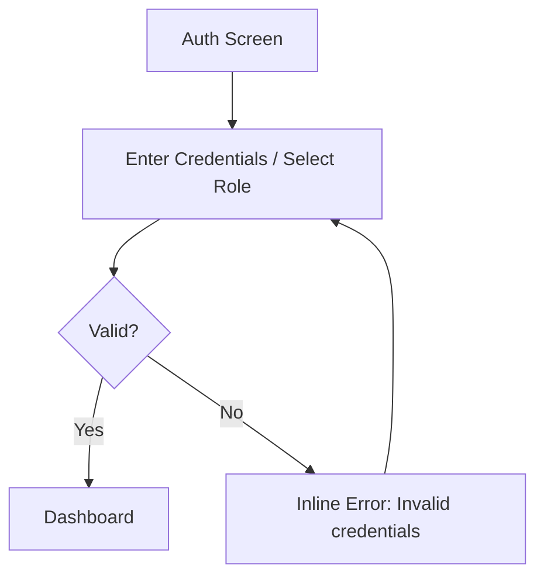
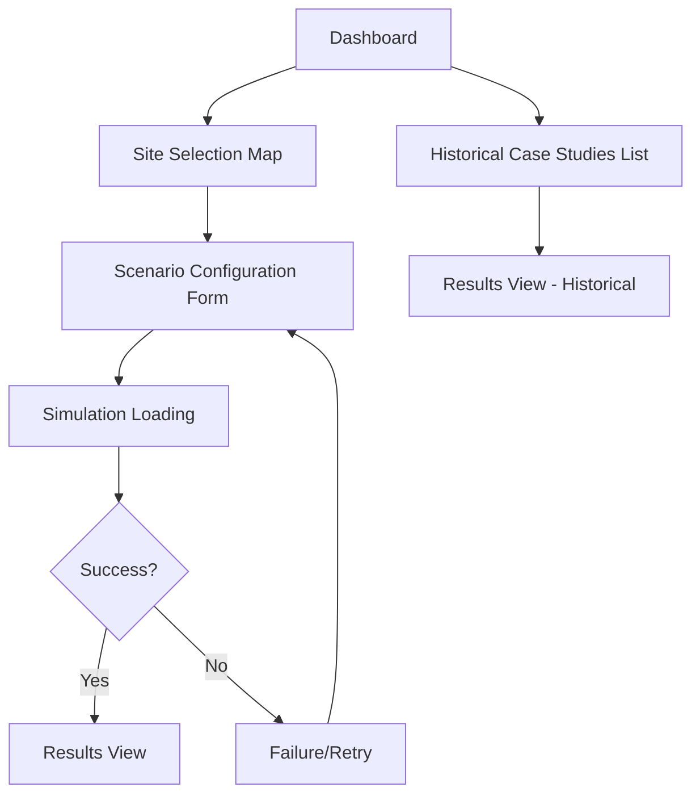
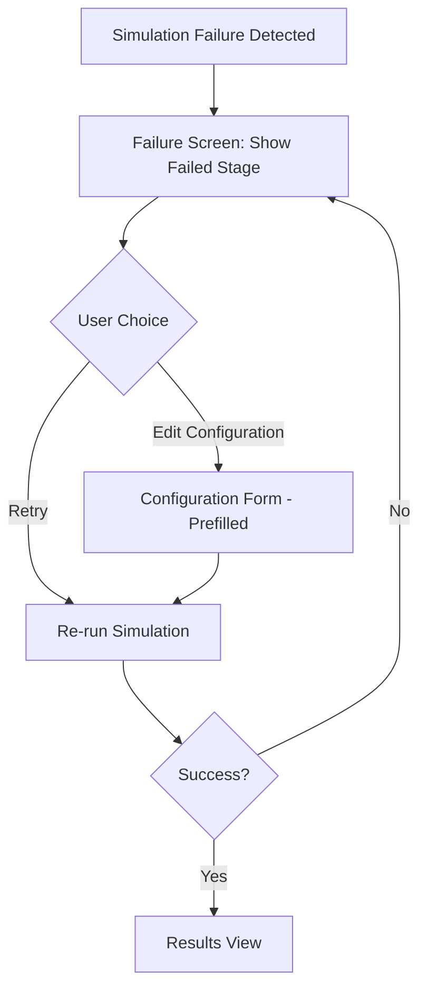

# App Flow Document
## FloodPath — Rapid Dam & Glacial Lake Breach Inundation Scenario Tool
### SIH 2026 — Problem Statement 26161

This document maps every major screen and user journey defined by the PRD, from entry to successful task completion, including error, loading, empty, and permission states. UI design is intentionally out of scope — this defines structure and behavior only.

---

## 0. High-Level Flow Overview

---

## 1. Landing Page

- **Purpose:** Introduce the tool, communicate what it does, and route the user to sign-in or directly into the dashboard for a demo.
- **User actions:** View intro content, click "Enter Tool" / "Sign In", view a sample historical case study preview.
- **Inputs:** None.
- **Outputs:** Navigation only.
- **Navigation destination:** Auth screen (if login required) or Dashboard (demo mode).
- **API/data required:** None (static content), optionally a lightweight "featured case study" fetch.
- **Loading behavior:** Static page; near-instant load; optional skeleton for the featured case-study thumbnail.
- **Error behavior:** If the featured case-study fetch fails, hide that section silently — landing page still functions.
- **Empty state:** N/A (static content).

---

## 2. Authentication

*For hackathon MVP, this can be a lightweight/demo login (e.g., role selection: District Officer / Analyst / Guest) rather than full production auth — noted per PRD's "not required for hackathon MVP demo."*

- **Purpose:** Identify the user's role to tailor dashboard content (optional for MVP; can default to "Guest/Analyst" view).
- **User actions:** Enter credentials or select a demo role, submit.
- **Inputs:** Username/password (or role selection for demo mode).
- **Outputs:** Auth token/session (or role flag for demo mode).
- **Navigation destination:** Dashboard.
- **API/data required:** Auth endpoint (or none, if demo-role-only).
- **Loading behavior:** Spinner on submit button while auth resolves.
- **Error behavior:** Invalid credentials → inline error message, form remains editable, no navigation.
- **Empty state:** Empty form on first load; submit disabled until required fields are filled.

---

## 3. Onboarding

- **Purpose:** Give first-time users a brief walkthrough of the core flow (select site → configure → run → interpret results) so non-technical users (e.g., Persona: Anjali) aren't lost.
- **User actions:** Step through 3–4 short explanatory screens or dismiss/skip.
- **Inputs:** None (click "Next"/"Skip").
- **Outputs:** Onboarding-complete flag stored for the session/user.
- **Navigation destination:** Dashboard.
- **API/data required:** None (static content).
- **Loading behavior:** Instant, static.
- **Error behavior:** N/A.
- **Empty state:** N/A.

---

## 4. Dashboard

- **Purpose:** Central hub — entry point to start a new scenario, view historical case studies, or manage past runs.
- **User actions:** Click "New Scenario," select a historical case study, view past simulation runs, navigate to profile/settings, log out.
- **Inputs:** None directly; selections trigger navigation.
- **Outputs:** Navigation to relevant sub-flow.
- **Navigation destination:** Site Selection (new scenario), Results View (past run or case study), Profile/Settings, Logout.
- **API/data required:** Fetch user's past simulation runs (if any), fetch list of available historical case studies.
- **Loading behavior:** Skeleton cards for past-runs list and case-study list while fetching.
- **Error behavior:** If past-runs fetch fails, show inline retry notice in that section; rest of dashboard remains usable.
- **Empty state:** First-time user with no past runs → show a prompt card: "No scenarios yet — start your first one" with a direct CTA into Site Selection.

---

## 5. Core Feature Flows

### 5a. Site Selection (Map)

- **Purpose:** Let the user pick the dam/lake location to simulate.
- **User actions:** Pan/zoom map, click a point, search by place name, select from a shortlist of known high-risk sites.
- **Inputs:** Map click coordinates, or text search query.
- **Outputs:** Selected lat/long coordinate passed to configuration form.
- **Navigation destination:** Scenario Configuration Form.
- **API/data required:** Map tile service, place-name search/geocoding, optional pre-flagged high-risk site list.
- **Loading behavior:** Map tiles load progressively; search results show a small spinner.
- **Error behavior:** If geocoding search fails, show inline "no results found, try clicking directly on the map" message.
- **Empty state:** Default map view centered on Himalayan region with no point selected; "Confirm Location" button disabled until a point is chosen.

### 5b. Scenario Configuration Form

*(See Section 6 — Forms, detailed below.)*

### 5c. Simulation Execution

- **Purpose:** Run the DEM fetch → breach estimation → flood-routing pipeline.
- **User actions:** Wait, or cancel the run.
- **Inputs:** Configuration form payload (coordinates + parameters).
- **Outputs:** Flood extent dataset, arrival-time data, impact summary.
- **Navigation destination:** Results View (on success) or Failure/Retry State (on error).
- **API/data required:** DEM fetch API, breach-parameter calculation, flood-routing engine, settlement/population data overlay.
- **Loading behavior:** Multi-step progress indicator (e.g., "Fetching terrain data" → "Estimating breach parameters" → "Running flood simulation" → "Preparing results").
- **Error behavior:** Any pipeline stage failure routes to Failure/Retry State with the specific failed stage indicated.
- **Empty state:** N/A (transient loading screen).

### 5d. Historical Case Study Replay

- **Purpose:** Let users run/view a pre-validated historical event (e.g., Rishi Ganga 2021) to build trust in the tool.
- **User actions:** Select a case study from a list, view its pre-computed or re-run results.
- **Inputs:** Case study selection.
- **Outputs:** Results view populated with historical scenario data.
- **Navigation destination:** Results View.
- **API/data required:** Pre-stored case study dataset (recommended for reliability over live re-simulation during a demo).
- **Loading behavior:** Brief spinner if re-running live; instant if pre-computed.
- **Error behavior:** If case study data fails to load, show error card with retry option.
- **Empty state:** N/A (fixed list of case studies).

---

## 6. Forms

### Scenario Configuration Form

- **Purpose:** Collect the parameters needed to run a simulation for the selected site.
- **User actions:** Enter/confirm dam or lake dimensions (height, volume — with sensible pre-filled defaults where DEM-derivable), select breach type (structural/overtopping vs. landslide/GLOF), adjust simulation extent radius, submit.
- **Inputs:** Numeric fields (height, volume estimate if known), dropdown (breach type), radius/area selector.
- **Outputs:** Validated configuration payload sent to Simulation Execution.
- **Navigation destination:** Simulation Loading screen (on submit).
- **API/data required:** Auto-populated DEM-derived estimates (dam height/volume approximation) to reduce manual input burden.
- **Loading behavior:** Auto-fill fields show a brief spinner while DEM-derived estimates are calculated.
- **Error behavior:** Invalid/out-of-range input → inline field-level validation errors; submit disabled until resolved.
- **Empty state:** Fields pre-filled with DEM-derived defaults where possible; clearly marked as "estimated — adjust if known."

---

## 7. Results

- **Purpose:** Present the flood extent, arrival times, and plain-language impact summary.
- **User actions:** Toggle map layers (extent, depth, arrival time), scrub a time slider to see flood progression, view village-level impact list, trigger export/share/compare actions.
- **Inputs:** Time-slider position, layer toggle selections.
- **Outputs:** Rendered map overlays, textual impact summary, exportable report.
- **Navigation destination:** Actions (export/share/compare), back to Dashboard.
- **API/data required:** Simulation output dataset (flood polygons per time step, arrival times, affected settlements list).
- **Loading behavior:** Map layers load progressively; time-slider scrubbing should feel near-instant (pre-computed time steps).
- **Error behavior:** If a specific layer (e.g., population overlay) fails to load, show that layer as unavailable without blocking the rest of the results.
- **Empty state:** If no settlements fall within the simulated flood extent, show a clear "No populated areas identified within simulated extent" message rather than a blank list.

---

## 8. Actions

- **Export Report:** Generates a shareable summary (PDF/plain text) of the impact summary and map snapshot.
- **Share Scenario:** Generates a link or shareable state for the current scenario/results.
- **Compare Scenarios:** (Should Have) Select a second scenario/breach size to view side-by-side.
- **Re-run with Adjusted Parameters:** Returns user to the Configuration Form with prior inputs pre-filled.

- **Loading behavior:** Export/share show a brief spinner while the report/link is generated.
- **Error behavior:** If export generation fails, show retry option; results view remains intact and unaffected.

---

## 9. Navigation

- **Persistent elements:** Top-level nav bar with Dashboard, New Scenario, Historical Case Studies, Profile/Settings, Logout.
- **Contextual navigation:** Breadcrumb-style back navigation through Site Selection → Configuration → Results.
- **Deep-linking:** Results view supports being loaded directly via a shared link/scenario ID.

---

## 10. Profile/Settings

- **Purpose:** Let the user manage basic preferences (role, units — metric only for MVP, default map region).
- **User actions:** View/edit role, set default map view region, log out.
- **Inputs:** Role selection, default region selection.
- **Outputs:** Updated preference values persisted to session/user profile.
- **Navigation destination:** Dashboard (on save).
- **API/data required:** User preference storage (session-level acceptable for MVP; no persistent account system required).
- **Loading behavior:** Brief spinner on save.
- **Error behavior:** Save failure → inline error, form retains entered values.
- **Empty state:** Defaults shown on first visit (role: Guest/Analyst, region: Himalayan belt).

---

## 11. Error States

- **Network/API failure:** Generic error card with a retry button, specific to the failed stage (e.g., "DEM data unavailable for this region").
- **Invalid input:** Inline, field-level validation messages; form remains editable.
- **Simulation failure:** Failure/Retry screen (see Section 16) with the failed pipeline stage clearly indicated.
- **Unsupported region:** If the selected coordinates fall outside available DEM/case-study coverage, show a clear message before allowing form submission.

---

## 12. Loading States

- **Map tiles:** Progressive tile loading with a lightweight spinner overlay.
- **Simulation pipeline:** Multi-step progress indicator naming each stage (DEM fetch → breach estimation → flood routing → summary generation).
- **Results layers:** Skeleton/placeholder overlays while each map layer populates independently.
- **Dashboard lists:** Skeleton cards for past runs and case studies while fetching.

---

## 13. Empty States

- **Dashboard, first-time user:** "No scenarios yet" prompt with direct CTA to Site Selection.
- **Site Selection, no point chosen:** "Confirm Location" disabled, helper text: "Click the map or search a location to begin."
- **Results, no settlements affected:** Explicit "No populated areas identified within simulated extent" message.
- **Historical Case Studies, none available (fallback):** "Case studies loading — check back shortly" (should not occur in practice since these are pre-loaded, but handled defensively).

---

## 14. Permission States

- **Guest/Demo role:** Full access to run scenarios and view historical case studies; cannot save scenarios beyond the session.
- **District Officer / Analyst role:** Can save and revisit past scenario runs, access export/share actions.
- **Restricted region access (future/non-MVP):** Placeholder for role-based data-sensitivity restrictions (e.g., certain sites flagged for authorized users only) — out of scope for MVP but structurally noted per PRD's future scalability section.

---

## 15. Logout

- **Purpose:** End the user's session.
- **User actions:** Click "Logout" from nav or Profile/Settings.
- **Inputs:** None (confirmation click).
- **Outputs:** Session/token cleared.
- **Navigation destination:** Landing Page.
- **API/data required:** Session termination endpoint (or client-side session clear for demo-role mode).
- **Loading behavior:** Instant.
- **Error behavior:** N/A — logout should not fail in a way that blocks the user; clear local session regardless.
- **Empty state:** N/A.

---

## 16. Failure/Retry Flows

- **Purpose:** Handle simulation pipeline failures gracefully without losing user input.
- **User actions:** View the specific failure reason, click "Retry," or "Edit Configuration" to adjust inputs before retrying.
- **Inputs:** None new (reuses prior configuration payload unless user edits it).
- **Outputs:** Re-triggered simulation run, or navigation back to the Configuration Form with values pre-filled.
- **Navigation destination:** Simulation Loading (on retry) or Configuration Form (on edit).
- **API/data required:** Same pipeline endpoints as the original run.
- **Loading behavior:** Same multi-step progress indicator as the original run.
- **Error behavior:** Repeated failures show an escalated message (e.g., "This region may be outside current data coverage") rather than looping silently.
- **Empty state:** N/A.

