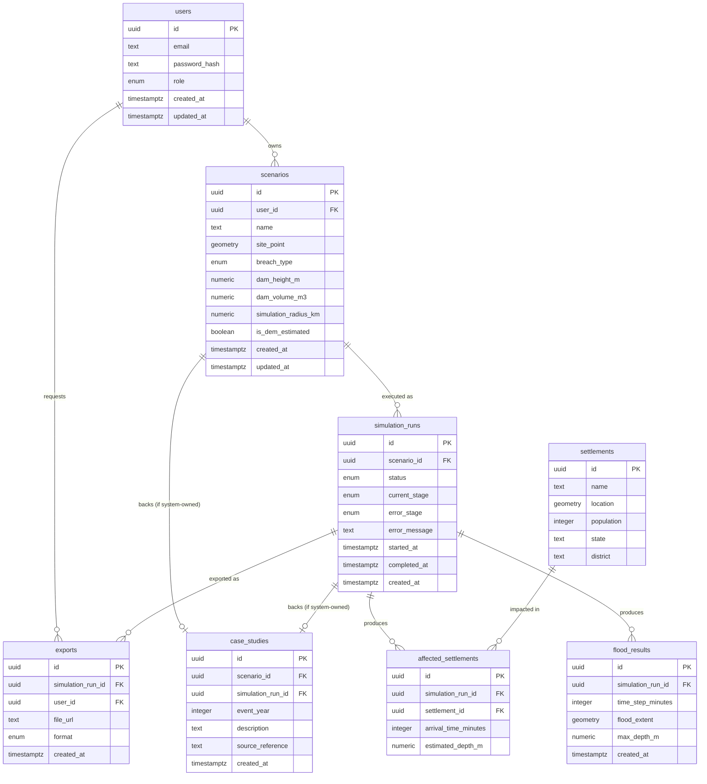

# Database Schema
## FloodPath — Rapid Dam & Glacial Lake Breach Inundation Scenario Tool
### SIH 2026 — Problem Statement 26161

Target: PostgreSQL 15+ with the PostGIS extension (per the Technical Requirements Document). All geometry columns use SRID 4326 (WGS 84). Every table required by MVP functionality in the PRD/App Flow is included; nothing beyond that.

---

## 1–7. Tables, Columns, Data Types, Keys, Relationships, Constraints

### `users`

Holds authenticated accounts. Guest/demo-role sessions (per the App Flow) do not require a row here — they operate with a client-side role flag and no persisted scenarios, consistent with the PRD's "no persistent account system required" note.

| Column | Type | Constraints |
|---|---|---|
| `id` | UUID | PRIMARY KEY, default `gen_random_uuid()` |
| `email` | TEXT | NOT NULL, UNIQUE |
| `password_hash` | TEXT | NOT NULL |
| `role` | `user_role` (ENUM: `analyst`) | NOT NULL, DEFAULT `'analyst'` |
| `created_at` | TIMESTAMPTZ | NOT NULL, DEFAULT `now()` |
| `updated_at` | TIMESTAMPTZ | NOT NULL, DEFAULT `now()` |

*Only one persisted role (`analyst`) exists — `guest` is a session-only state with no database row, per Section 9 below.*

---

### `scenarios`

A user-defined dam/lake breach scenario (site + configuration), created before a simulation is run.

| Column | Type | Constraints |
|---|---|---|
| `id` | UUID | PRIMARY KEY, default `gen_random_uuid()` |
| `user_id` | UUID | FOREIGN KEY → `users(id)` ON DELETE CASCADE, NOT NULL |
| `name` | TEXT | NOT NULL |
| `site_point` | GEOMETRY(POINT, 4326) | NOT NULL |
| `breach_type` | `breach_type` (ENUM: `structural`, `landslide_glof`) | NOT NULL |
| `dam_height_m` | NUMERIC(8,2) | NOT NULL, CHECK (`dam_height_m > 0`) |
| `dam_volume_m3` | NUMERIC(14,2) | NOT NULL, CHECK (`dam_volume_m3 > 0`) |
| `simulation_radius_km` | NUMERIC(6,2) | NOT NULL, DEFAULT `25`, CHECK (`simulation_radius_km > 0`) |
| `is_dem_estimated` | BOOLEAN | NOT NULL, DEFAULT `false` — marks whether height/volume were auto-filled from DEM per the Configuration Form's UI requirement |
| `created_at` | TIMESTAMPTZ | NOT NULL, DEFAULT `now()` |
| `updated_at` | TIMESTAMPTZ | NOT NULL, DEFAULT `now()` |

---

### `simulation_runs`

One row per execution attempt of the pipeline for a scenario (supports retry, per the Failure/Retry flow — a scenario may have more than one run).

| Column | Type | Constraints |
|---|---|---|
| `id` | UUID | PRIMARY KEY, default `gen_random_uuid()` |
| `scenario_id` | UUID | FOREIGN KEY → `scenarios(id)` ON DELETE CASCADE, NOT NULL |
| `status` | `run_status` (ENUM: `pending`, `running`, `succeeded`, `failed`) | NOT NULL, DEFAULT `'pending'` |
| `current_stage` | `pipeline_stage` (ENUM: `dem_fetch`, `breach_estimation`, `flood_routing`, `summary_generation`) | NULLABLE |
| `error_stage` | `pipeline_stage` | NULLABLE — set only when `status = 'failed'`, per the App Flow's requirement to name the failed stage |
| `error_message` | TEXT | NULLABLE |
| `started_at` | TIMESTAMPTZ | NULLABLE |
| `completed_at` | TIMESTAMPTZ | NULLABLE |
| `created_at` | TIMESTAMPTZ | NOT NULL, DEFAULT `now()` |

---

### `flood_results`

Time-stepped flood-extent output from a completed simulation run — one row per time step, feeding the Results view's time-slider.

| Column | Type | Constraints |
|---|---|---|
| `id` | UUID | PRIMARY KEY, default `gen_random_uuid()` |
| `simulation_run_id` | UUID | FOREIGN KEY → `simulation_runs(id)` ON DELETE CASCADE, NOT NULL |
| `time_step_minutes` | INTEGER | NOT NULL, CHECK (`time_step_minutes >= 0`) |
| `flood_extent` | GEOMETRY(MULTIPOLYGON, 4326) | NOT NULL |
| `max_depth_m` | NUMERIC(6,2) | NULLABLE |
| `created_at` | TIMESTAMPTZ | NOT NULL, DEFAULT `now()` |

`UNIQUE (simulation_run_id, time_step_minutes)` — a run cannot have two rows for the same time step.

---

### `settlements`

Reference data: populated places used to compute impact summaries. Seeded, not user-created (per Section 12).

| Column | Type | Constraints |
|---|---|---|
| `id` | UUID | PRIMARY KEY, default `gen_random_uuid()` |
| `name` | TEXT | NOT NULL |
| `location` | GEOMETRY(POINT, 4326) | NOT NULL |
| `population` | INTEGER | NULLABLE |
| `state` | TEXT | NOT NULL |
| `district` | TEXT | NOT NULL |

---

### `affected_settlements`

Junction table: which settlements are impacted by a given simulation run, and when — the data source for the Results view's village-level table.

| Column | Type | Constraints |
|---|---|---|
| `id` | UUID | PRIMARY KEY, default `gen_random_uuid()` |
| `simulation_run_id` | UUID | FOREIGN KEY → `simulation_runs(id)` ON DELETE CASCADE, NOT NULL |
| `settlement_id` | UUID | FOREIGN KEY → `settlements(id)` ON DELETE RESTRICT, NOT NULL |
| `arrival_time_minutes` | INTEGER | NOT NULL, CHECK (`arrival_time_minutes >= 0`) |
| `estimated_depth_m` | NUMERIC(6,2) | NULLABLE |

`UNIQUE (simulation_run_id, settlement_id)` — a settlement appears once per run.

---

### `case_studies`

Reference data: pre-validated historical events (e.g., Rishi Ganga 2021), each backed by a system-owned scenario and its completed run — reused rather than duplicating the results structure, per the Technical Requirements' "no unnecessary tables" principle.

| Column | Type | Constraints |
|---|---|---|
| `id` | UUID | PRIMARY KEY, default `gen_random_uuid()` |
| `scenario_id` | UUID | FOREIGN KEY → `scenarios(id)` ON DELETE RESTRICT, NOT NULL, UNIQUE |
| `simulation_run_id` | UUID | FOREIGN KEY → `simulation_runs(id)` ON DELETE RESTRICT, NOT NULL, UNIQUE |
| `event_year` | INTEGER | NOT NULL |
| `description` | TEXT | NOT NULL |
| `source_reference` | TEXT | NULLABLE — citation/link for the validation data used |
| `created_at` | TIMESTAMPTZ | NOT NULL, DEFAULT `now()` |

*The `scenarios.user_id` for a case-study's backing scenario references a fixed system account (seeded — see Section 12), not an end user, so no nullable FK is needed.*

---

### `exports`

Generated shareable report artifacts, per the Results view's Export/Share action.

| Column | Type | Constraints |
|---|---|---|
| `id` | UUID | PRIMARY KEY, default `gen_random_uuid()` |
| `simulation_run_id` | UUID | FOREIGN KEY → `simulation_runs(id)` ON DELETE CASCADE, NOT NULL |
| `user_id` | UUID | FOREIGN KEY → `users(id)` ON DELETE CASCADE, NOT NULL |
| `file_url` | TEXT | NOT NULL — object storage reference |
| `format` | `export_format` (ENUM: `pdf`, `json`) | NOT NULL |
| `created_at` | TIMESTAMPTZ | NOT NULL, DEFAULT `now()` |

---

## 8. Indexes

| Table | Index | Reason |
|---|---|---|
| `users` | UNIQUE btree on `email` | Login lookup, already implied by the UNIQUE constraint |
| `scenarios` | btree on `user_id` | Dashboard's "list current user's scenarios" query |
| `scenarios` | GIST on `site_point` | Spatial lookups (e.g., proximity checks against `settlements`/`case_studies`) |
| `simulation_runs` | btree on `scenario_id` | Fetch all runs for a scenario (retry history) |
| `simulation_runs` | btree on `status` | Worker polling for pending jobs |
| `flood_results` | btree on `(simulation_run_id, time_step_minutes)` | Time-slider ordered fetch (also enforced by the UNIQUE constraint above) |
| `flood_results` | GIST on `flood_extent` | Spatial queries against flood polygons |
| `settlements` | GIST on `location` | Core "which settlements fall within this flood polygon" query during pipeline execution |
| `affected_settlements` | btree on `simulation_run_id` | Results view's village-impact table fetch |
| `case_studies` | btree on `scenario_id`, `simulation_run_id` | Already covered by UNIQUE constraints above |
| `exports` | btree on `user_id` | User's export history, if ever listed |

---

## 9. User Roles

Two roles total, matching the Technical Requirements Document's authorization section — no more:

- **`analyst`** (persisted `users.role`): can create, run, save, retrieve, delete, and export their own scenarios.
- **`guest`** (session-only, no database row): can create and run scenarios within a session but cannot persist them past the session — enforced entirely at the application layer (no `scenarios` row is ever created for a guest session; results are held client-side or in a short-lived cache, not written to this schema).

No `admin` role exists in the schema for MVP — seeding and management of `settlements` and `case_studies` reference data is done via migration/seed scripts (Section 12), not an in-app admin role, since the PRD does not call for in-app content management in MVP.

---

## 10. Permissions

Enforced at the application layer (FastAPI dependency checking the JWT role claim, per the Technical Requirements Document) rather than via a database permissions table — a separate permissions table would be unnecessary complexity for a two-role, resource-ownership-based model:

| Action | `analyst` | `guest` |
|---|---|---|
| Create/run scenario | Own scenarios | Session-only, not persisted |
| View scenario | Own scenarios only (`scenarios.user_id = current_user.id`) | Session-only |
| Delete scenario | Own scenarios only | N/A |
| Export report | Own scenarios only | Session-only export allowed, not saved |
| View case studies | Yes | Yes |

Row-level ownership is enforced by filtering every `scenarios`/`simulation_runs`/`exports` query on `user_id = current_user.id` in the API layer.

---

## 11. Audit Fields

- `created_at` on every table (set once, immutable).
- `updated_at` on mutable tables only (`users`, `scenarios`) — tables that are effectively append-only after creation (`simulation_runs`, `flood_results`, `affected_settlements`, `exports`, `case_studies`) omit `updated_at` since their rows are not edited after insert, only superseded by new rows (e.g., a retry creates a new `simulation_runs` row rather than mutating the failed one, preserving run history).
- `simulation_runs.started_at` / `completed_at` double as both audit and functional fields (used for the PRD's "time from site selection to usable output" success metric).

---

## 12. Required Seed Data

- **`settlements`**: populated-place data for the demo region (Himalayan belt), sourced from public census/OSM data per the Technical Requirements Document — required for any simulation run to produce a non-trivial impact summary.
- **`users`**: one fixed system account (e.g., `system@floodpath.internal`) to own the case-study scenarios, so `case_studies.scenario_id` always has a valid owner without exposing a nullable FK.
- **`case_studies`** + their backing **`scenarios`**, **`simulation_runs`**, and **`flood_results`** rows: at minimum one fully pre-computed historical event (Rishi Ganga 2021, per the Problem Analysis and PRD's validation requirement) — this is required for the Historical Case Study Replay flow to function at all, and is the tool's primary credibility demonstration in a hackathon judging context.

---

## ER Diagram

