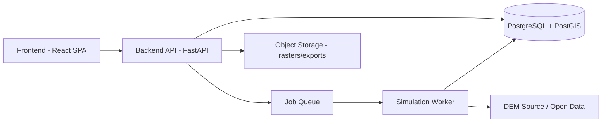

# Technical Requirements Document
## FloodPath — Rapid Dam & Glacial Lake Breach Inundation Scenario Tool
### SIH 2026 — Problem Statement 26161

Architecture goal: the simplest stack that can reliably run a DEM → breach estimation → flood-routing → results pipeline within a hackathon timeline, built on technologies with a clear, low-friction path to a real production deployment — no component chosen for novelty.

---

## 1. System Architecture

A standard three-tier web architecture: a single-page frontend, a stateless REST API backend, and a relational database with spatial extensions — plus an asynchronous job runner for the simulation pipeline itself, since flood-routing is too slow to run synchronously inside an HTTP request.

**Why this shape:** it separates the fast, interactive parts (site selection, form, results browsing) from the slow, compute-heavy part (the actual simulation), so the UI never blocks waiting on a multi-minute pipeline. This is the same separation a production version would need — nothing here is hackathon-only scaffolding that must be thrown away later.

---

## 2. Frontend Technology

- **React** (with Vite) for the SPA.
- **Mapbox GL JS** or **MapLibre GL JS** (open-source, no vendor lock-in) for the map canvas — needed for the map-dominant layout defined in the design brief, including custom raster/polygon overlay rendering for flood extent.
- **TypeScript** — catches data-shape mismatches between frontend and the simulation-output API early, which matters more here than in a typical CRUD app because the payloads (geospatial polygons, time-series arrays) are structurally complex.

**Why not more:** no heavier framework (Next.js, Redux) is needed — this is a single-page interactive tool, not a multi-route content site, and local component state plus a lightweight fetch layer is sufficient.

---

## 3. Backend Technology

- **Python + FastAPI** for the API layer.

**Why Python specifically:** the simulation pipeline (DEM processing, breach-parameter formulas, flood routing, and any ML surrogate) needs `numpy`, `rasterio`, `scipy`, and geospatial libraries (`rasterio`, `shapely`, `geopandas`) that are mature in Python and would otherwise need to be reimplemented or awkwardly wrapped from another language. Using the same language for API and simulation logic avoids a second service boundary purely for language reasons.

**Why FastAPI specifically:** async support (useful for kicking off background jobs without blocking), automatic request/response validation via Pydantic (directly supports Requirement 14 below), and automatic OpenAPI docs generation — useful both for hackathon demo credibility and for a real handoff to other developers.

---

## 4. Database

- **PostgreSQL with the PostGIS extension.**

**Why:** the core data (dam/lake locations, watershed boundaries, flood-extent polygons, affected-settlement points) is inherently spatial. PostGIS gives native geometry types and spatial queries (e.g., "which settlement points fall within this flood polygon") instead of hand-rolling that logic in application code. Plain PostgreSQL is otherwise sufficient for everything else (users, scenarios, past runs) — no separate NoSQL store is needed since the data is structured and relational.

---

## 5. Authentication

- Simple **JWT-based session auth**, issued on login.
- For the hackathon MVP, a lightweight demo-role login (per the App Flow) is acceptable — but should still go through the same JWT mechanism rather than a special-cased bypass, so the auth path doesn't need to be rebuilt for a production version.

**Why JWT over session cookies + server-side session store:** removes the need for a session-store service (e.g., Redis) purely for auth, which is unnecessary complexity at this scale. A production deployment adding refresh-token rotation later is a straightforward extension of the same mechanism, not a rearchitecture.

---

## 6. Authorization

- Simple **role-based access control** with two roles for MVP: `analyst` (can create/run/save scenarios) and `guest` (can run scenarios in-session only, per the Permission States in the App Flow).
- Enforced at the API layer via a FastAPI dependency checking the JWT's role claim — not duplicated in the frontend beyond hiding unavailable actions from the UI.

**Why minimal roles:** the PRD does not call for complex organizational hierarchies (district vs. state vs. central) in the MVP — that's explicitly a future-scalability item, so building it now would be unnecessary complexity ahead of need.

---

## 7. API Architecture

**REST**, not GraphQL.

**Why:** the data-access patterns here are simple and screen-driven (per the App Flow — each screen needs a predictable, specific payload: scenario config, simulation status, results). GraphQL's flexibility solves a problem (many varied client query shapes against the same data) that doesn't exist yet at this scale, and it adds a real learning-curve and tooling cost inappropriate for a hackathon timeline.

---

## 8. API Endpoints

| Method | Endpoint | Purpose |
|---|---|---|
| POST | `/auth/login` | Authenticate, issue JWT |
| GET | `/scenarios` | List current user's past scenario runs |
| POST | `/scenarios` | Create a new scenario (site + config) |
| GET | `/scenarios/{id}` | Fetch a specific scenario's configuration and status |
| POST | `/scenarios/{id}/run` | Trigger the simulation pipeline (async job) |
| GET | `/scenarios/{id}/status` | Poll simulation job status/stage |
| GET | `/scenarios/{id}/results` | Fetch completed results (flood extent, arrival times, impact summary) |
| DELETE | `/scenarios/{id}` | Delete a saved scenario |
| GET | `/case-studies` | List available historical case studies |
| GET | `/case-studies/{id}/results` | Fetch pre-computed historical results |
| GET | `/dem/preview` | Fetch DEM-derived auto-fill estimates for a selected point (used by the configuration form) |
| POST | `/scenarios/{id}/export` | Generate a shareable/exportable report |

Status polling (rather than WebSockets) is used for simulation progress — simple, stateless, and sufficient given the multi-minute (not sub-second) update cadence needed.

---

## 9. AI Architecture

Per the PRD, AI is used narrowly and only where it adds genuine value — not as a bolted-on chatbot.

- **MVP:** deterministic, published empirical formulas for breach-parameter estimation (no ML required) and a simplified flood-routing algorithm (cellular-automaton or diffusive-wave raster spread) — this is standard numerical computation, not AI.
- **Should-Have (post-MVP-core, stretch goal within hackathon time):** an ML surrogate model (e.g., a gradient-boosted regressor or small neural net via `scikit-learn`/`PyTorch`) trained on a set of pre-computed flood-routing runs, used to produce near-instant results for new scenarios. This is the one place ML is justified: it demonstrably solves the "full physics-based solve is slow" problem the PRD identifies.

**Why not more AI:** the PRD explicitly rejected decorative AI (e.g., a chatbot layer) — every AI component here has a specific, named performance or automation problem it solves.

---

## 10. External APIs

- **Open DEM data source:** USGS EarthExplorer / OpenTopography API (SRTM/ASTER 30m) — free, open-license, matches the PRD's stated data assumption.
- **Map tiles:** OpenStreetMap-based tile provider (via MapLibre) — avoids a paid Google Maps dependency.
- **Geocoding/place search:** Nominatim (OpenStreetMap) — sufficient for place-name search in Site Selection, open and free.
- **Settlement/population overlay data:** publicly available census or OSM settlement-point data, fetched/cached rather than queried live per request.

**Why open sources throughout:** matches the PRD's constraint of no proprietary licensing costs, and keeps the tool deployable by a government agency without a paid vendor contract — relevant beyond the hackathon.

---

## 11. File Storage

- **Object storage** (e.g., S3-compatible — AWS S3, or a free-tier equivalent like Cloudflare R2/Supabase Storage for hackathon deployment) for DEM tiles cached locally, generated flood-extent raster outputs, and exported PDF/report files.

**Why not store these in the database:** raster and report files are large binary blobs; storing them in PostgreSQL would bloat the database and slow backups for no benefit — object storage is the standard, low-friction fit, and the database instead stores references (URLs/keys) to these objects.

---

## 12. Notifications

- **Not required for MVP.** The App Flow's polling-based status check (`/scenarios/{id}/status`) is sufficient for a synchronous demo session.
- **Future (per PRD's future scalability):** SMS/mobile push alerting for last-mile warning is a named future feature, which would require a provider (e.g., an SMS gateway) — explicitly out of MVP scope, so not built now.

---

## 13. Security

- HTTPS enforced at the deployment layer (standard on any modern hosting platform — not custom-built).
- Passwords (if real accounts are used beyond demo-role login) hashed with `bcrypt`.
- JWTs signed with a strong secret, short expiry, stored in an httpOnly cookie or secure client storage (not `localStorage` for anything beyond the demo).
- No secrets committed to source control (see Section 18 — Environment Variables).
- CORS restricted to the known frontend origin(s).

---

## 14. Input Validation

- **Pydantic models** in FastAPI validate every request payload's shape and types automatically — coordinate ranges, breach-type enum values, numeric bounds on dam height/volume, all enforced at the API boundary before any pipeline logic runs.
- Server-side validation is authoritative; frontend validation (per the design brief's inline form errors) is a UX convenience only, never trusted alone.

---

## 15. Error Handling

- Structured error responses (`{ "error_code": ..., "message": ... }`) so the frontend can map specific failures to the plain-language messages defined in the App Flow's Failure/Retry flow (e.g., distinguishing "DEM data unavailable for this region" from a generic 500).
- Each simulation pipeline stage (DEM fetch, breach estimation, flood routing) catches and reports its own failure with a stage identifier, matching the App Flow's requirement to show *which* stage failed.

---

## 16. Logging

- Structured application logging (Python's standard `logging` module, JSON-formatted) at the API and worker layers — request IDs, scenario IDs, and pipeline stage timing.
- **Why this matters beyond the demo:** pipeline stage timing logs directly support the PRD's success metric ("time from site selection to usable output"), so logging is functional, not just operational hygiene.
- No need for a dedicated log-aggregation platform (e.g., ELK) at hackathon scale — stdout logs captured by the hosting platform are sufficient; this is a documented upgrade path for production, not a build-now requirement.

---

## 17. Rate Limiting

- Basic per-user rate limiting on the `/scenarios/{id}/run` endpoint (e.g., via FastAPI middleware or a simple in-memory/Redis-backed limiter) to prevent accidental or abusive repeated triggering of the expensive simulation pipeline.
- Not needed on read-only/list endpoints at this scale.

---

## 18. Environment Variables

- `DATABASE_URL`, `JWT_SECRET`, `OBJECT_STORAGE_KEY`/`SECRET`, `DEM_API_KEY` (if the chosen DEM provider requires one), `MAP_TILE_API_KEY` (if not using a keyless open tile source), `CORS_ALLOWED_ORIGINS`.
- Managed via `.env` locally (excluded from version control) and the hosting platform's secret-management UI in deployment — no custom secrets-management service needed at this scale.

---

## 19. Deployment

- **Frontend:** static build deployed to Vercel or Netlify (free tier sufficient for a hackathon demo, trivial CI/CD via Git integration).
- **Backend + worker:** containerized (Docker) and deployed to a platform such as Render or Railway (both have free/low-cost tiers, support background workers alongside the web service, and require no Kubernetes/infra management).
- **Database:** managed PostgreSQL with PostGIS (Render, Railway, or Supabase all offer this directly) — avoids self-hosting a database during a hackathon.

**Why not Kubernetes/custom infra:** entirely unjustified complexity at this scale and timeline; every recommended platform here has a straightforward upgrade path (more dynos/instances, larger DB tier) without a rearchitecture.

---

## 20. Scalability

- The async job-queue separation (Section 1) is the key scalability decision: simulation workers can be scaled horizontally (more worker instances) independently of the API layer as load grows, without changing the architecture.
- PostGIS scales well for the spatial query patterns here up to a large number of scenarios/case studies; no need for a specialized geospatial database at any realistic scale for this tool.
- DEM tiles and computed results are cacheable in object storage — repeated requests for the same region don't require re-fetching/re-processing, which is the main cost driver to manage as usage grows.

---

## 21. Performance Requirements

- Interactive screens (site selection, dashboard, forms) should respond within standard web-app expectations (under ~300ms for API calls excluding the simulation itself).
- The simulation pipeline should target completion within a few minutes for a moderate watershed on the MVP's simplified flood-routing method — explicitly *not* real-time, and the UI is designed (staged progress indicator) around that expectation rather than hiding it.
- The optional ML surrogate (Section 9) is the identified path to near-instant results for repeat/similar scenarios — a performance improvement layered on top of the MVP pipeline, not a Day 1 requirement.

---

## 22. Testing Strategy

- **Unit tests** (`pytest`) for breach-parameter formulas and flood-routing logic — these are deterministic numerical functions with known-correct outputs for at least the validated historical case study, making them straightforward and high-value to test.
- **API integration tests** for each endpoint in Section 8, particularly validation edge cases (Section 14) and error responses (Section 15).
- **Frontend component tests** (Vitest/React Testing Library) for the Configuration Form's validation behavior and the Results view's empty/error states, since these are the states most likely to be demoed live and most damaging to get visibly wrong.
- **One end-to-end smoke test** (e.g., Playwright) covering the full happy path — site selection → configuration → run → results — since this is the exact path a hackathon demo will perform live.
- No dedicated load/performance testing suite required for MVP — appropriate to defer until real usage patterns exist, per the scalability section's incremental-scaling approach.
